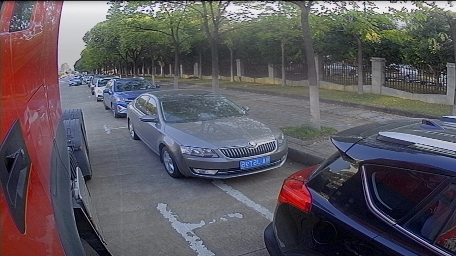

<!-- ## update -->
---

+ ## YUV
YUV，分为三个分量，`Y`表示明亮度（Luminance或Luma），也就是灰度值；而`U`和`V` 表示的则是色度（Chrominance或Chroma),
作用是描述影像色彩及饱和度，用于指定像素的颜色。

__YUV格式有两大类__：`planar` 和 `packed`:
`planar`的`YUV`格式，先连续存储所有像素点的`Y`，紧接着存储所有像素点的`U`，随后是所有像素点的`V`。

`packed`的`YUV`格式，每个像素点的`Y,U,V`是连续交错存储的。

```python
    Y Y Y Y Y Y                   
    Y Y Y Y Y Y                  
    Y Y Y Y Y Y                   
    Y Y Y Y Y Y                    
    U U U U U U                        Y U Y V Y U Y V Y U Y V
    U U U U U U                        Y U Y V Y U Y V Y U Y V
    V V V V V V                        Y U Y V Y U Y V Y U Y V
    V V V V V V                        Y U Y V Y U Y V Y U Y V
    - Planar -                          - Packed -
```
**YUV与RGB的转换公式**

```python
B = Y + 1.7790 * (U - 128)
G = Y - 0.3455 * (U - 128) - 0.7169 * (V - 128)
R = Y + 1.4075 * (V - 128)

RGB To YUV

Y = 0.299 * R + 0.587 * G + 0.114 * B
U = (B - Y) / 1.772
v = (R - Y) / 1.402  (U ~(-128 - 127))
```
+ ## YUYV4:2:2格式数据

下面的四个像素为:`[Y0 U0 V0] [Y1 U1 V1] [Y2 U2 V2][Y3 U3 V3]`

存放的码流为:`Y0 U0 Y1 V1 Y2 U2 Y3 V3`

映射出像素点为:`[Y0 U0 V1][Y1 U0 v1] [Y2 U2 V3][Y3 U2 V3]`


+ ## yuv422p 内存分布
```python
                    w
            +--------------------+
            |Y0Y1Y2Y3...         |
            |...                 |   h
            |...                 |
            |                    |
            +--------------------+
            |U0U1      |
            |...       |   h
            |...       |
            |          |
            +----------+
            |V0V1      |
            |...       |  h
            |...       |
            |          |
            +----------+
                w/2
``` 

+ ## yuv420p 内存分布
```python
                    w
            +--------------------+
            |Y0Y1Y2Y3...         |
            |...                 |   h
            |...                 |
            |                    |
            +--------------------+
            |U0U1      |
            |...       |   h/2
            |...       |
            |          |
            +----------+
            |V0V1      |
            |...       |  h/2
            |...       |
            |          |
            +----------+
                w/2
```

```python
uint8_t* dst_y = yuvI420;
int dst_y_stride = width;

uint8_t* dst_u = yuvI420 + width * height;
int dst_u_stride = (width + 1) / 2;

uint8_t* dst_v = (yuvI420 + width * height) + dst_u_stride * ((height + 1) / 2);
int dst_v_stride = (width + 1) / 2;

libyuv::ARGBToI420(
                argb.data, 
                width * 4, 
                
                dst_y,
                dst_y_stride, 
                
                dst_u, 
                dst_u_stride, 
                
                dst_v, 
                dst_v_stride, 
                
                width,                                          
                height
            );
```

+ ## demo 
因项目需要，使用`libyuv` 对 `yuyv(yuy2)`格式图像进行处理，主要实现为：

`yuyv(yuy2) ---> I420 ---> I420Scale ---> BGRA`

缩放后图片：




## 编译运行
```
# on msys2/mingw64
# vim ~/bashrc
# export PATH=.:/wingw64/bin:/wingw64/lib:$PATH
git clone https://github.com/5455945/libyuv_testDemo.git
cd libyuv_testDemo && mkdir build && cd build
cmake -G"Unix Makefiles" -S .. -B .
cmake --build .
./yuyv2i420.exe
./yuv2rgb.exe
```

```
soft@lfyp12023 MINGW64 ~
$ cd /d/git/mygit

soft@lfyp12023 MINGW64 /d/git/mygit
$ git clone https://github.com/5455945/libyuv_testDemo.git
Cloning into 'libyuv_testDemo'...
remote: Enumerating objects: 30, done.
remote: Counting objects: 100% (30/30), done.
remote: Compressing objects: 100% (27/27), done.
remote: Total 30 (delta 10), reused 20 (delta 3), pack-reused 0
Receiving objects: 100% (30/30), 2.55 MiB | 2.78 MiB/s, done.
Resolving deltas: 100% (10/10), done.

soft@lfyp12023 MINGW64 /d/git/mygit
$ cd libyuv_testDemo && mkdir build && cd build

soft@lfyp12023 MINGW64 /d/git/mygit/libyuv_testDemo/build
$ cmake -G"Unix Makefiles" -S .. -B .
-- The C compiler identification is GNU 13.2.0
-- The CXX compiler identification is GNU 13.2.0
-- Detecting C compiler ABI info
-- Detecting C compiler ABI info - done
-- Check for working C compiler: D:/install/msys64/mingw64/bin/cc.exe - skipped
-- Detecting C compile features
-- Detecting C compile features - done
-- Detecting CXX compiler ABI info
-- Detecting CXX compiler ABI info - done
-- Check for working CXX compiler: D:/install/msys64/mingw64/bin/c++.exe - skipped
-- Detecting CXX compile features
-- Detecting CXX compile features - done
-- Found OpenCV: D:/install/msys64/mingw64 (found version "4.8.0")
-- Configuring done (1.5s)
-- Generating done (0.0s)
-- Build files have been written to: D:/git/mygit/libyuv_testDemo/build

soft@lfyp12023 MINGW64 /d/git/mygit/libyuv_testDemo/build
$ cmake --build .
[ 25%] Building CXX object CMakeFiles/yuyv2i420.dir/yuyv2i420.cpp.obj
[ 50%] Linking CXX executable yuyv2i420.exe
[ 50%] Built target yuyv2i420
[ 75%] Building CXX object CMakeFiles/yuv2rgb.dir/yuv2rgb.cpp.obj
[100%] Linking CXX executable yuv2rgb.exe
[100%] Built target yuv2rgb

soft@lfyp12023 MINGW64 /d/git/mygit/libyuv_testDemo/build
$ ./yuyv2i420.exe

******************* opencv *******************
yuyv   convert  to  BGR :  1.4498    ms

 ******************* libyuv *******************
yuy2 -> yuv420   time :  0.3738    ms
 yuv420 -> BGR  convert   time :  0.1882    ms
 yuy2 -> yuv420 -> BGR  convert   time :  0.562    ms


soft@lfyp12023 MINGW64 /d/git/mygit/libyuv_testDemo/build
$ ./yuv2rgb.exe
next read
----- I420  scale to width  :  320       height   :  180
----- END
```
